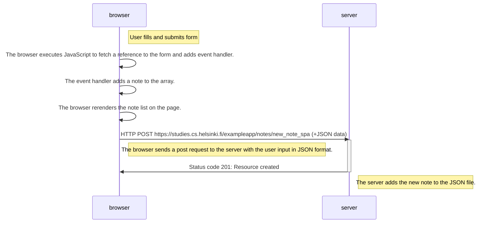

```mermaid
sequenceDiagram
    participant browser
    participant server

    Note right of browser: User fills and submits form

    browser->>browser: The browser executes JavaScript to fetch a reference to the form and adds event handler.

    browser->>browser: The event handler adds a note to the array.

    browser->>browser: The browser rerenders the note list on the page.


    browser->>server: HTTP POST https://studies.cs.helsinki.fi/exampleapp/notes/new_note_spa (+JSON data)
    activate server

    Note right of browser: The browser sends a post request to the server with the user input in JSON format. 

    server->>browser: Status code 201: Resource created
    deactivate server

    Note right of server: The server adds the new note to the JSON file.

```