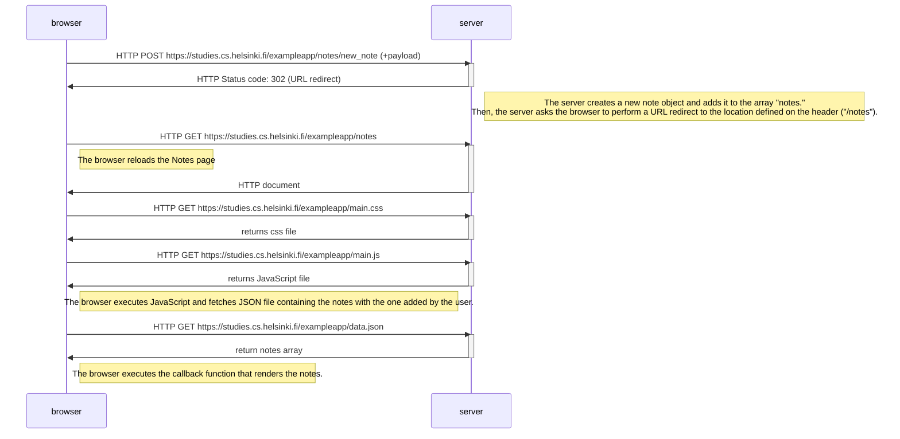

# New Note Diagram

```mermaid
sequenceDiagram
    participant browser
    participant server

    browser->>server: HTTP POST https://studies.cs.helsinki.fi/exampleapp/notes/new_note (+payload)
    activate server
    server->>browser: HTTP Status code: 302 (URL redirect)
    deactivate server
    
    Note right of server: The server creates a new note object and adds it to the array "notes." <br/> Then, the server asks the browser to perform a URL redirect to the location defined on the header ("/notes").

    browser->>server: HTTP GET https://studies.cs.helsinki.fi/exampleapp/notes
    activate server

    Note right of browser: The browser reloads the Notes page

    server->>browser: HTTP document
    deactivate server

    browser->>server: HTTP GET https://studies.cs.helsinki.fi/exampleapp/main.css
    activate server
    server->>browser: returns css file
    deactivate server

    browser->>server: HTTP GET https://studies.cs.helsinki.fi/exampleapp/main.js
    activate server
    server->>browser: returns JavaScript file
    deactivate server

    Note right of browser: The browser executes JavaScript and fetches JSON file containing the notes with the one added by the user.

    browser->>server: HTTP GET https://studies.cs.helsinki.fi/exampleapp/data.json
    activate server
    server->>browser: return notes array
    deactivate server

    Note right of browser: The browser executes the callback function that renders the notes. 

```